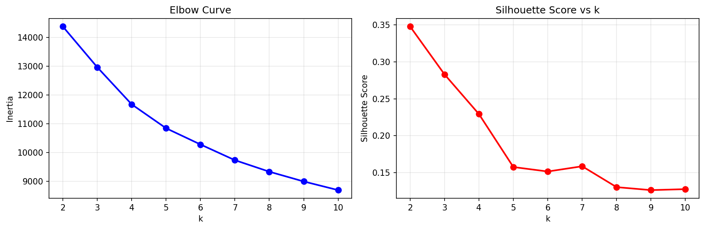
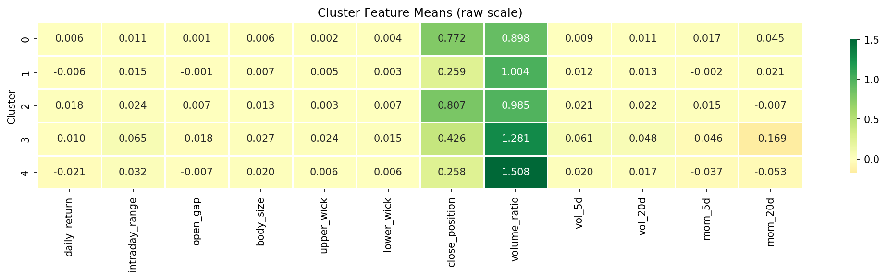
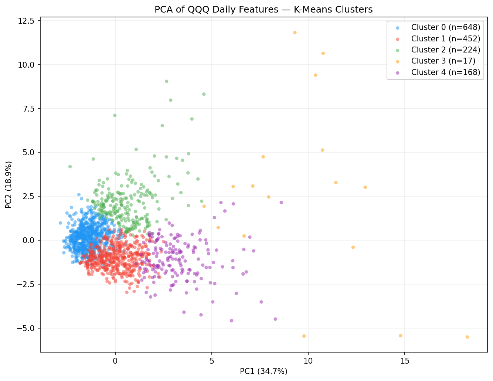
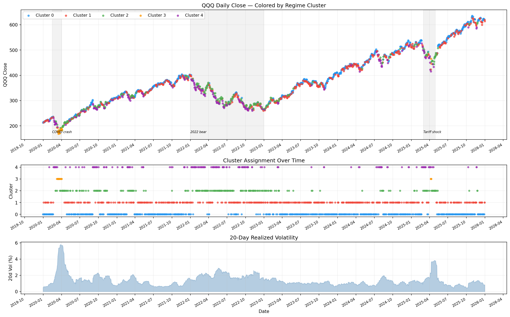
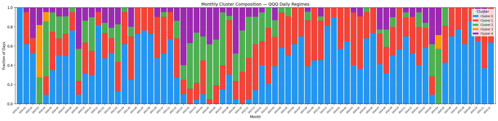
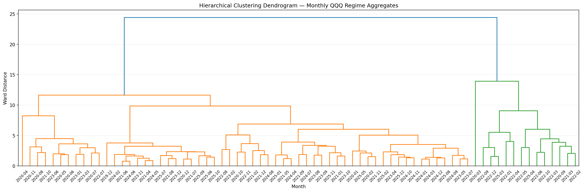
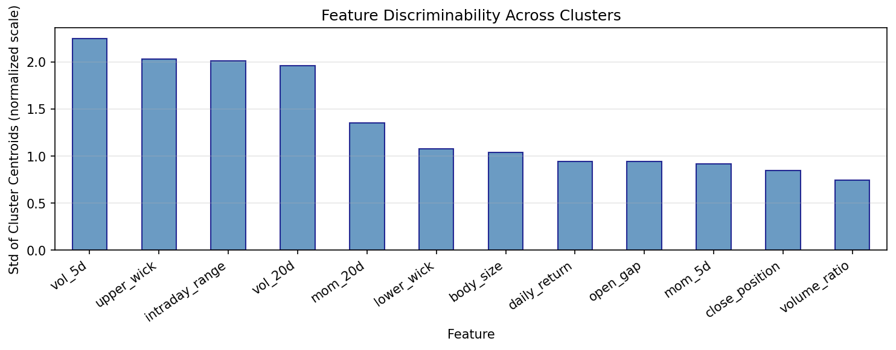

# QQQ Daily Regime Clustering Analysis

**Date:** 2026-05-31  
**Data:** QQQ daily bars, 2019-12-02 → 2025-12-31 (1,509 trading days after feature warmup)  
**Goal:** Determine whether QQQ daily bars cluster into meaningfully distinct market regimes as the first step in a two-stage trading system.

---

## Setup

### Features (per trading day)

| Feature | Description |
|---------|-------------|
| `daily_return` | (close − prev_close) / prev_close |
| `intraday_range` | (high − low) / close |
| `open_gap` | (open − prev_close) / prev_close |
| `body_size` | |close − open| / close |
| `upper_wick` | (high − max(open,close)) / close |
| `lower_wick` | (min(open,close) − low) / close |
| `close_position` | (close − low) / (high − low) — 0=bottom, 1=top of range |
| `volume_ratio` | volume / 20-day rolling avg volume |
| `vol_5d` | 5-day rolling std of daily returns |
| `vol_20d` | 20-day rolling std of daily returns |
| `mom_5d` | (close / close[-5]) − 1 |
| `mom_20d` | (close / close[-20]) − 1 |

All features normalized with `StandardScaler`. K-means with `n_init=50` for stability.

---

## Key Finding: k=2 is the Natural Split, k=5 is Actionable

The silhouette score peaks at **k=2 (score=0.348)** and falls monotonically after. This tells us something fundamental: **at the daily-bar level, the market separates cleanly into calm vs. volatile days, not into named market regimes**. There is no crisp k=4 or k=6 elbow corresponding to "bull / mild-correction / strong-correction / crisis."

We ran k=5 because it provides operationally useful granularity — within the volatile days, direction (up vs. down) matters for the downstream prediction model. The tradeoff: the k=5 clusters are less crisply separated than k=2.

---

## The 5 Clusters

| Cluster | n | Label | daily_return | intraday_range | close_position | volume_ratio | vol_5d | mom_20d |
|---------|---|-------|:------------:|:--------------:|:--------------:|:------------:|:------:|:-------:|
| **C0** | 648 (43%) | Normal Bull | +0.58% | 1.11% | 0.77 | 0.90x | 0.91% | +4.5% |
| **C1** | 452 (30%) | Normal Bear | −0.63% | 1.48% | 0.26 | 1.00x | 1.16% | +2.1% |
| **C2** | 224 (15%) | Volatile Up | +1.81% | 2.36% | 0.81 | 0.99x | 2.13% | −0.7% |
| **C3** | 17  (1%)  | Crash/Crisis | −1.05% | 6.53% | 0.43 | 1.28x | 6.09% | −16.9% |
| **C4** | 168 (11%) | Sharp Down | −2.08% | 3.19% | 0.26 | 1.51x | 1.96% | −5.3% |

### Cluster interpretations

**C0 — Normal Bull (43% of days)**  
Positive daily return, tight range, close near the top of the bar (close_position=0.77), below-average volume (0.90x), positive 20d momentum (+4.5%). These are the typical days of a healthy uptrend. Highest count; forms the backbone of 2021 and 2023–2024 bull runs.

**C1 — Normal Bear (30%)**  
Small negative return, moderate range, close near the bottom of the bar (close_position=0.26), average volume. Crucially, **20d momentum is still +2.1%** — these are down days occurring within an overall uptrend or mild correction, not sustained bear markets. The mirror image of C0.

**C2 — Volatile Up (15%)**  
Large positive return (+1.81%), wide intraday range, elevated rolling volatility, but **negative 20d momentum** (−0.7%). These are strong bounce-back days that appear inside bear or correction periods. April 2025 tariff shock month was dominated by C2 (11 out of 20 days) — the bounce-back days after the crash outnumbered the crash days.

**C3 — Crash/Crisis (1%, only 17 days in 6 years)**  
Extreme outlier cluster. Range is 6.53% (nearly 6× normal), vol_5d = 6.09% (nearly 7× normal), 20d momentum = −16.9%. Upper wick unusually large (2.4% = intraday rejection from highs). Volume 1.28x average. These are the tail-risk days: COVID crash (March 2020), tariff shock (April 2025). Only **17 days total in 6 years**. The existing crisis gate (`recent_label_rate > 8% → suspend`) already catches the periods these days cluster in.

**C4 — Sharp Down (11%)**  
Large negative return (−2.08%), wide range, close near the bottom (0.26), and **very high volume (1.51x)** — the highest volume ratio of any non-crisis cluster. Strongly negative momentum (−5.3% over 20d). These are capitulation-style selling days. They concentrate in early 2020, throughout 2022, and in 2025-03/04.

---

## PCA Visualization

PCA explains 53.6% of variance in 2 components (PC1=34.7%, PC2=18.9%):
- **PC1 (horizontal)**: volatility axis — calm days on the left, high-volatility days on the right. C3 outliers appear far right.
- **PC2 (vertical)**: direction axis — C2 (volatile up) sits top-right; C4 (sharp down) sits bottom-right.
- C0 and C1 form a tight cluster on the left (calm days), separated only by direction (close_position and daily_return).
- There is **no clean separation** between C0 and C1 in PCA space — consistent with the k=2 silhouette finding that up/down within calm markets is the natural split.

---

## Time Series: Cluster Assignment Over History

Key periods visible in the cluster-over-time panel:

| Period | Dominant Clusters | Interpretation |
|--------|-------------------|----------------|
| 2019-12 – 2020-02 (pre-COVID) | C0, C1 | Normal bull market |
| 2020-03 (COVID crash) | C4, C3 | Sharp selling + crisis tail days |
| 2020-04–05 (COVID recovery) | C2, C0 | Explosive bounce-back days |
| 2021 | C0, C1 | Strong bull, very few C4 |
| 2022 (bear) | C4, C1, C2 | Heavy selling, elevated volatility, intermittent bounces |
| 2023–2024 (bull) | C0, C1 | Return to calm; C0 increasingly dominant |
| 2025-03 (correction) | C4=7, C2=7, C1=4, C0=2 | Volatile, roughly symmetric up/down days |
| 2025-04 (tariff crash) | C2=11, C4=6, C3=3 | Bounce-back days outnumber crash days; crisis tail present |
| 2025-11 (mild correction) | C1=8, C0=7, C4=2, C2=2 | Mostly normal days — correction is subtle at day level |
| 2025-12 (normal) | C0=14, C1=7 | Calm bull distribution |

---

## Monthly Cluster Composition

This chart shows the fraction of days in each cluster per month, and is the most useful visualization for a regime classifier. Key patterns:

- **Bull months**: blue (C0) dominates (>50%), small red (C1) minority.
- **Bear/correction months**: heavy purple (C4) and green (C2), blue shrinks.
- **Crisis months** (2020-03, 2025-04): orange (C3) spikes appear.
- **The C0 fraction is the single best regime indicator** — months where C0 < 25% are almost always correction or bear periods.

A simple regime classifier could compute a **rolling 20-day C0 fraction** and threshold it. This is more robust than using raw price returns because it captures the day-level character of the market (range, volume, wick patterns) not just the cumulative return.

---

## Hierarchical Dendrogram on Monthly Aggregates

The dendrogram reveals a clean **two-branch macro structure**:
- **Left branch (orange)**: Most months from 2020-2025. Within this, 2020 COVID-recovery months cluster together (2020-04, 2020-08, 2020-10, 2020-11), and the 2021 bull months form their own tight sub-cluster.
- **Right branch (green)**: **2022 bear market months cluster distinctly and completely separately** from all other months. 2022-01 through 2022-12 sit in a tight green subtree, with 2025-03 and some other correction months pulled toward that branch.

This confirms that **bear markets form a genuinely distinct macro regime** that is detectable at the monthly-feature level — not just a matter of having more down days.

---

## Feature Discriminability

Ranking of features by std of cluster centroids (normalized scale):

| Rank | Feature | Score | Why it discriminates |
|------|---------|:-----:|----------------------|
| 1 | `vol_5d` | 2.23 | Crisis (C3) has 6.1% vs bull (C0) 0.91% |
| 2 | `upper_wick` | 2.04 | C3 has large intraday rejection from highs |
| 3 | `intraday_range` | 2.01 | Volatility proxy; C3=6.5% vs C0=1.1% |
| 4 | `vol_20d` | 1.97 | Slower-moving companion to vol_5d |
| 5 | `mom_20d` | 1.37 | Bear clusters have strongly negative 20d momentum |
| 6 | `lower_wick` | 1.09 | Intraday support/rejection |
| 7 | `body_size` | 1.05 | Magnitude of candle body |
| 8 | `daily_return` | 0.96 | Directional signal |
| 9 | `open_gap` | 0.95 | Overnight gap direction |
| 10 | `mom_5d` | 0.94 | Short-term trend |
| 11 | `close_position` | 0.86 | Where close lands in bar |
| 12 | `volume_ratio` | 0.76 | Elevated in C3/C4 but noisy |

**Implication for the regime classifier feature set:** `vol_5d`, `vol_20d`, `intraday_range`, and `mom_20d` are the four features that most clearly separate regimes. Volume_ratio has the least discriminating power despite intuition — it's noisy within clusters.

---

## Critical Limitation: Day-Type vs. Period-Type Regimes

The clustering identifies **day-types**, not **market periods**. A "correction period" in the traditional sense (e.g., 2025-03) contains all 5 cluster types. The proportion shifts — more C4, less C0 — but no single day-type is exclusive to any regime.

For the two-stage system, the Stage 1 "regime classifier" therefore **should not operate on individual days**. Instead, it should operate on a **rolling window of daily features** (e.g., the past 15–20 trading days) and ask: "given the recent distribution of day-types, what macro regime are we in?"

---

## Implications for the Two-Stage System

### What was confirmed
1. Different market regimes do show meaningfully different daily patterns — the clustering validates the hypothesis.
2. Volatility features (vol_5d, vol_20d, intraday_range) are the strongest discriminators, not price direction alone.
3. The crisis cluster (C3) is tiny (17 days/6 years) and extreme — the existing hard gate (`recent_label_rate > 8%`) is the right approach, not a trainable classifier.
4. The 2022 bear market is a distinct macro regime that hierarchical clustering separates cleanly from everything else.

### What this means for the classifier design
- **Use rolling window features**, not single-day features. A 15-day rolling window of `vol_5d`, `vol_20d`, `intraday_range`, `mom_20d`, and **C0-fraction** (fraction of recent days assigned to C0 by a pre-trained cluster model) should be strong regime signals.
- **3–4 regimes is operationally tractable**: Bull (C0-dominant), Transition/Mild-correction (mixed C0/C1/C2), Correction/Bear (C4/C2-dominant), Crisis (C3-present + suspend). This aligns with the manually defined threshold table in `utils/regime_threshold.py`.
- **The mild correction regime (2025-11) is the hardest case**: It showed nearly normal day-type distributions (C0=7, C1=8), meaning a day-level feature set may not distinguish it from a flat period. Longer lookback or trend features needed.

### Recommended next step
Train a **rolling-window regime classifier** using the 4 top discriminating features (`vol_5d`, `vol_20d`, `intraday_range`, `mom_20d`) computed over a 15-day lookback, using the K-means cluster labels as pseudo-ground-truth, evaluated on the 7 known manually-labeled regime months as a held-out validation set.

---

## Plots Summary

| File | Contents |
|------|----------|
| `01_elbow_silhouette.png` | K selection: elbow + silhouette for k=2..10 |
| `02_pca_clusters.png` | 2D PCA scatter colored by cluster |
| `03_cluster_profile_heatmap.png` | Mean feature values per cluster |
| `04_timeseries_clusters.png` | Price + cluster assignment + vol over 2019–2025 |
| `05_monthly_cluster_composition.png` | Stacked fraction of day-types per month |
| `06_monthly_dendrogram.png` | Hierarchical clustering of monthly feature medians |
| `07_feature_discriminability.png` | Feature ranking by centroid spread |
