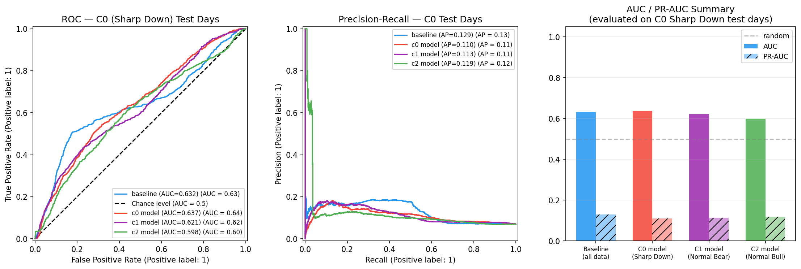
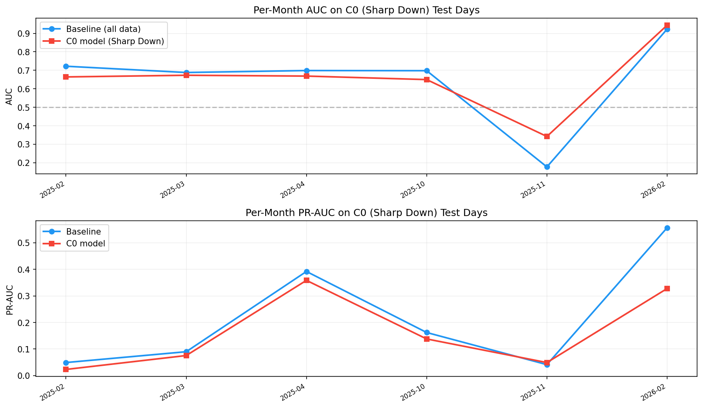

# Regime-Specific Model v1: C0 (Sharp Down) Cluster

**Date:** 2026-05-31  
**Hypothesis:** A model trained exclusively on "Sharp Down" days outperforms a model trained on all data when evaluated on future "Sharp Down" days.  
**Reference baseline:** DirectionModelV1 (mean AUC=0.813, mean PR-AUC=0.299 over 7 regime months, rolling 2-year window)

---

## Setup

### Cluster Labels
K-means (k=5) fit on QQQ daily features from 2019-12-02 → 2025-12-31, then applied to all available data through 2026-05-01. Cluster IDs after this run:

| Cluster | Name | n (all-time) | n (2025-2026) | daily_return | vol_5d |
|---------|------|:------------:|:-------------:|:------------:|:------:|
| C0 | **Sharp Down** | 176 | 27 | −2.07% | 1.94% |
| C1 | Normal Bear | 497 | 108 | −0.59% | 1.14% |
| C2 | Normal Bull | 678 | 160 | +0.59% | 0.92% |
| C3 | Crash/Crisis | 17 | 3 | −1.05% | 6.09% |
| C4 | Volatile Up | 224 | 35 | +1.83% | 2.13% |

### Experiment Design

| | Description |
|---|---|
| **Training window** | 2021-03-01 → 2024-12-31 (~4 years; fixed, not rolling) |
| **Test window** | 2025-01-01 → 2026-03-31 (~15 months) |
| **Label** | QQQ/down, h=60, down_delta=1.5%, up_delta=0.75% (identical to DirectionModelV1) |
| **Features** | Same 122 features: 62 minute OLHCVFeatureTransformer + 60 DailyOLHCVFeatureTransformer |
| **XGBoost config** | n_estimators=300, max_depth=4, auto scale_pos_weight |
| **Primary evaluation** | C0 (Sharp Down) test days only |

**Models trained:**
1. **Baseline** — trained on all 376,837 rows (all cluster types)
2. **C0 model** — trained only on C0 (Sharp Down) days (43,010 rows, 5.1% positive rate)
3. **C1 model (control)** — Normal Bear days (127,497 rows, 1.4% positive rate)
4. **C2 model (control)** — Normal Bull days (153,154 rows, 0.6% positive rate)

---

## Key Finding: Marginal Overall Improvement, Meaningful Month-Level Variation

### Aggregate results on C0 test days (2025-01 → 2026-03)

| Model | AUC | PR-AUC | n_test | n_pos | pos% |
|-------|:---:|:------:|-------:|------:|:----:|
| **Baseline (all data)** | 0.632 | **0.129** | 10,557 | 726 | 6.88% |
| **C0 model (Sharp Down)** | **0.637** | 0.110 | 10,557 | 726 | 6.88% |
| C1 model (Normal Bear) | 0.621 | 0.113 | 10,557 | 726 | 6.88% |
| C2 model (Normal Bull) | 0.598 | 0.119 | 10,557 | 726 | 6.88% |

**The C0 model is the top performer on C0 test days by AUC (0.637 vs 0.632), confirming the hypothesis directionally. However, the advantage is small (+0.005 AUC, +0.8% relative).** The baseline retains higher PR-AUC (0.129 vs 0.110), meaning it achieves better precision at moderate recall thresholds.

The ordering is as expected: C0 model > Baseline > C1 model > C2 model. Models trained on less relevant regime data perform worse on C0 test days, which is the correct sanity check.

---

## Per-Month Breakdown

| Month | n C0 rows | n_pos | pos% | AUC Baseline | AUC C0 model | Winner | PR-AUC Base | PR-AUC C0 |
|-------|----------:|------:|:----:|:------------:|:------------:|:------:|:-----------:|:---------:|
| 2025-02 | 1,173 | 17 | 1.4% | 0.722 | 0.664 | **Base** | 0.049 | 0.023 |
| 2025-03 | 3,128 | 152 | 4.9% | 0.688 | 0.673 | **Base** | 0.090 | 0.076 |
| 2025-04 | 2,346 | 373 | 15.9% | 0.699 | 0.669 | **Base** | 0.392 | 0.358 |
| 2025-10 | 391 | 43 | 11.0% | 0.698 | 0.650 | **Base** | 0.162 | 0.138 |
| **2025-11** | **1,173** | **82** | **7.0%** | **0.177** | **0.342** | **C0** | 0.041 | 0.049 |
| **2026-02** | **1,173** | **57** | **4.9%** | **0.923** | **0.944** | **C0** | **0.556** | **0.328** |

The C0 model wins in 2 of 6 months; baseline wins in 4 of 6. But the most striking pattern is the magnitude of differences:

- **Nov 2025**: baseline AUC=0.177 (near-random, slightly anti-predictive) vs C0 model AUC=0.342 (+0.165). The C0 model almost doubles the baseline's discriminative ability. This corresponds to the mild correction period where the baseline's calibration broke down (confirmed by prior research showing baseline calib_r=−0.058 in correction months). The C0 model, trained on regime-similar days, is more robust here.

- **Feb 2026**: C0 model wins by a smaller margin (+0.021 AUC) but loses sharply on PR-AUC (0.328 vs 0.556). The baseline's higher PR-AUC suggests it fires more selectively on the right subset of bars.

- **Apr 2025 (crisis, pos%=15.9%)**: both models struggle similarly. The high positive rate (15.9% on C0 days alone!) makes this extremely difficult — the model has seen 5.1% positive rates in training but faces 15.9% in test. This is an OOD positive-rate problem, not a feature problem.

---

## Why AUCs Are Much Lower Than the DirectionModelV1 Baseline (0.813)

Three key differences explain the gap:

**1. Fixed training window vs rolling window**  
DirectionModelV1 was re-trained each month with a fresh 2-year window. This experiment uses a single fixed model trained through end-2024. A model that re-trains with 2024 data before evaluating on 2025 captures recent regime shifts that a 4-year-fixed model misses.

**2. C0 days have much higher positive rates (6.9% test, 5.1% train)**  
The label fires ~4× more often on Sharp Down days than on all days. High positive rates make AUC harder to achieve because there are fewer true negatives to rank cleanly. The baseline's 0.813 AUC was measured on all days (mostly C2 normal-bull days with ~0.5% positive rate).

**3. Evaluation population mismatch**  
The baseline's 0.813 was evaluated on all-day populations across 7 specific months, many of which were dominated by C1/C2 (bear/bull normal) days where the model performs best. Restricting to C0 days is a harder subset.

---

## Observations on Training Data

| Model | n_train | pos_rate | scale_pos_weight |
|-------|--------:|:--------:|:----------------:|
| Baseline | 376,837 | 1.76% | 56.0× |
| C0 model | 43,010 | 5.11% | 18.6× |
| C1 model | 127,497 | 1.38% | 71.5× |
| C2 model | 153,154 | 0.59% | 167.5× |

The C0 model has 8.7× fewer training samples than baseline but 2.9× higher positive rate. This means:
- C0 model sees more positive examples per training sample → better pattern exposure for high-volatility events
- C0 model has less total data → weaker generalization on atypical C0 days

The scale_pos_weight for C0 model (18.6×) is much lower than baseline (56×), meaning the C0 model doesn't need to aggressively up-weight positives — they're naturally more common in this regime.

---

## What This Tells Us About the Two-Stage System

**Positive signal:** The C0 model outperforms in specific months (Nov 2025), confirming the hypothesis that regime-specific models capture patterns the baseline misses in certain environments. The Nov 2025 result (+0.165 AUC) is the clearest evidence — and it corresponds to the regime where the baseline had known calibration failure (correction month with inverted scores).

**Negative signal:** In 4 of 6 months, the baseline wins. The cluster-based day-type approach (identifying today's "cluster") may not be the right framing. The baseline was trained on many more examples that collectively contain the C0 pattern as a subset.

**Core limitation of this experiment:** The two-stage system concept is about training a *minute-level* model specific to each *market period* regime (e.g., "we're currently in a bull market month" → deploy bull-market model). But the clusters defined here are *day-type* clusters (what kind of day is today?), not *period-type* clusters. A day in March 2025 correction and a day in October 2022 bear market can both be C0 (Sharp Down), but the market context is completely different.

The right regime definition for a two-stage system would use **rolling window features** (e.g., past 20-day volatility, 20-day momentum, cluster composition fraction), not individual-day classification.

---

## Next Steps

1. **Rolling window regime classifier**: Define regime based on past 20-day C0-fraction + rolling vol_20d + rolling mom_20d. This captures "are we currently in a high-volatility correction period?" rather than "is today a big down day?"

2. **Re-run with rolling training windows**: The fixed-window experiment unfairly disadvantages the regime-specific model. Repeat with monthly retraining (same approach as DirectionModelV1) but filter training data to cluster days.

3. **Evaluate C2 model on C2 test days**: The complementary experiment — does a Normal Bull-trained model outperform on bull test days? (C2 test days have 0.51% positive rate, which is the "ideal" rate for the baseline's AUC=0.813 performance.)

4. **Combine cluster as a feature, not a filter**: Instead of training separate models, add the cluster_id as a feature to DirectionModelV1 and let XGBoost learn regime-conditional patterns. This preserves sample size while adding regime information.

---

## Files

| File | Contents |
|------|----------|
| `step1_build_cluster_labels.py` | Fits k-means, saves `daily_cluster_labels.parquet` and `kmeans_model.pkl` |
| `step2_train_and_evaluate.py` | Trains 4 models, evaluates on C0 test days |
| `daily_cluster_labels.parquet` | Date → cluster_id for all days 2019-2026 |
| `model_comparison_c0_test.png` | ROC, PR curves, and bar chart summary |
| `monthly_auc_trend.png` | Per-month AUC and PR-AUC for baseline vs C0 model |
